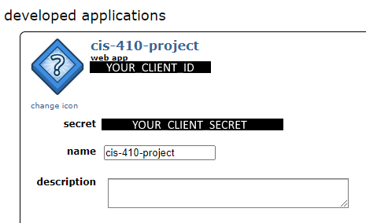
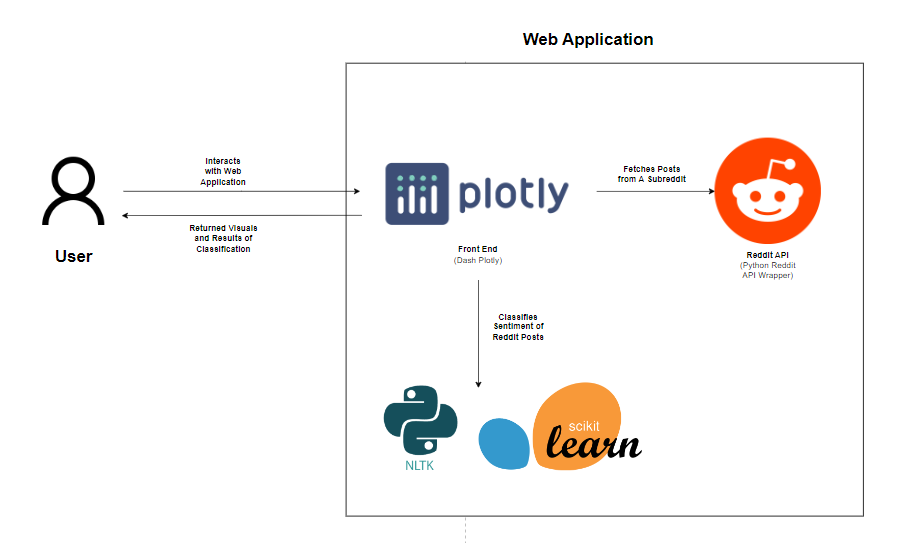

# CIS 410 - Group Project: Reddit Sentiment Analysis Dashboard

**Group Name** - Grade Simps

**Team Members** - Gautum Samudrala, Ansh Bhalla, Yiting Zhao, Matthew Do

**Captain** - Matthew Do

# Table of Contents

1. [Getting Started](#introduction)
2. [Web Application Architecture](#architecture)
3. [Challenges](#challenges)

<a name="introduction"></a>
# Getting Started 

Welcome to our CIS 410 Group project! Over the last few months, we have worked diligently on building an application to provide users with useful metrics and visualizations of their favorite subreddit. Follow the steps below to run the application locally on your computer.

## Signing up for Credentials to Authenticate to Reddit API
[Step By Step Instructions](reddit_setup.md)

Our dashboard requires access to the Reddit API. 

Before you can run this program, you must create a `Reddit Application` using this link [here](https://www.reddit.com/prefs/apps).

After creating your application, navigate to the `secret.py` module and substitute in the values for `CLIENT_SECRET` and `CLIENT_ID`.



The `USER_AGENT` can be any value you desire.


## Installing Dependencies

To install dependencies required to run all notebooks and applications, run the script in your terminal where `requirements.txt` is located.

```
pip install -r requirements.txt
```

## Running the Application

To run the application, run the following command in your terminal

```
python app.py
```

This will launch your `Dash Plotly` Application, and can usually be accessed using the following localhost link: http://127.0.0.1:8050/

<a name="architecture"></a>
# Web Application Architecture 



## Components

### Python Reddit API Wrapper(PRAW)

The Python Reddit API Wrapper allows our application to fetch posts from a specified subreddit. We then run some functions that clean the text data.

### Scikit-Learn NLTK

We pickled our models and encapsulated them in `models.py` and took an Object-Oriented approach to allow for easy use in our web application. These components are responsible for classifying and pre-processing text data.

### Dash Plotly

This is the front-end of our application. It is responsible for integrating our modules for analyzing sentiment and passing the data fetched from the Reddit API.


<a name="challenges"></a>
# Challenges

## Code Optimization

### Reddit API Limitations

Fetching posts is limited to 100 posts per call. For each batch of 100 posts, there is a delay of about 1 second. After testing with different amounts of posts, we discovered that about 300 posts offers the best balance between application performance and analytic utility. 

### Text Pre-Processing

TODO: Add what we did to optimize performance on ML Algos